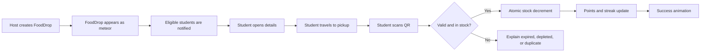
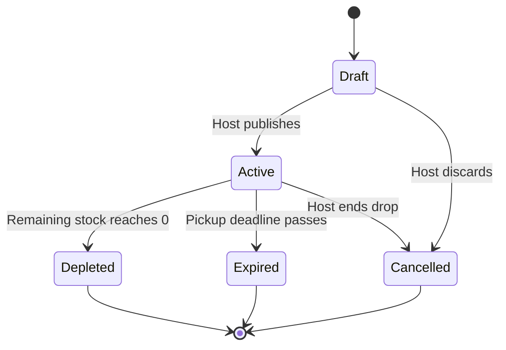

# PorsiPas V1 - Product and Engineering Handoff

## 1. Purpose of this document

This document records the current shared understanding of PorsiPas so that team members, mentors, judges, and coding agents can work from the same baseline. It is intended to be both human-readable and machine-readable.

This document distinguishes confirmed decisions from recommendations and unresolved questions. Future contributors must not silently treat an open decision as an agreed requirement.

Requirement language:

- **MUST** means required for the V1 hackathon prototype.
- **SHOULD** means strongly recommended, but removable if time is limited.
- **MAY** means optional or a stretch goal.
- **OUT OF SCOPE** means intentionally excluded from V1.
- **OPEN DECISION** means the team has not yet agreed on the final behavior.

## 2. Executive summary

PorsiPas is a standalone campus food-rescue mobile application. Caterers and event organizers publish time-sensitive surplus meals as **FoodDrops**. Students discover nearby FoodDrops on a meteor-themed map, see live remaining stock, travel to the pickup point, and scan a FoodDrop QR code to confirm collection. A successful scan atomically reduces stock and updates the student's points and streak.

The core promise is:

> Find surplus food nearby, collect it before it disappears, and build a rescue streak.

One-sentence pitch:

> **PorsiPas is a real-time campus food-rescue app where surplus meals appear as meteorite FoodDrops; students receive nearby alerts, track live availability, verify collection by QR, and build rescue streaks before the food disappears.**

Suggested tagline:

> **Catch the drop. Save the meal.**

## 3. Origin and problem context

NUS already has a Telegram community called **NUS Buffet Response Team**, where people post surplus catering food, buffet items, and bento boxes for students to collect free of charge on a first-come-first-served basis.

This existing behavior is validation that:

- Surplus prepared food exists on campus.
- Caterers and event organizers are willing to announce it.
- Students are willing to travel to collect it.
- Time-sensitive alerts are valuable.

The current chat-based process can still be improved:

- Posts are unstructured and may omit stock, expiry, dietary, or location details.
- Students cannot reliably see whether food is still available.
- Messages are difficult to sort by distance.
- A busy group makes relevant posts easy to miss.
- There is no verified record of a successful rescue.
- The process is useful but not intentionally engaging or sticky.

PorsiPas is not currently planned as a Telegram integration. The Telegram group is evidence of demand and a reference workflow, not a V1 technical dependency.

## 4. Hackathon brief alignment

The challenge is to motivate ordinary people to adopt more resource-conscious behavior through a fun, engaging, sticky, and polished product.

PorsiPas targets the concrete behavior of redirecting safe, unserved surplus food from disposal to consumption.

| Judging category | Weight | PorsiPas response |
|---|---:|---|
| Fun and engagement | 40% | Meteorite FoodDrops, time pressure, points, streaks, celebratory feedback, and later creature interactions |
| Behaviour change | 20% | A QR-verified meal rescue is a concrete, measurable action rather than a self-reported intention |
| Stickiness | 20% | Nearby alerts, live drops, streaks, and recurring campus supply create reasons to return |
| Craft and usability | 20% | A focused end-to-end flow for both caterers and students, with minimal data entry and clear live status |

Required hackathon deliverables from the brief:

- A working prototype: web app, mobile app, game, or bot.
- A two-to-three-minute demo video.
- A rationale explaining the audience and target behavior.

## 5. Product principles

1. **Rescue first, gamification second.** Points and characters support the sustainable action; they must never obscure it.
2. **Fast for both sides.** Posting a FoodDrop and collecting one should require minimal effort.
3. **Live truth matters.** Stock and status must update reliably enough that users do not travel toward already-depleted drops.
4. **No surveillance.** User locations must not be visible to other users or caterers.
5. **Do not reward overcollection.** Gamification must not encourage taking food that the user does not need.
6. **Cute but clear.** The meteor and creature theme should add delight without making essential information harder to understand.
7. **No AI for its own sake.** V1 does not require image recognition, calorie estimation, or a language model.

## 6. Confirmed decisions

| ID | Decision | Status |
|---|---|---|
| D-001 | PorsiPas V1 is a standalone app, not a Telegram bot or Telegram Mini App. | Confirmed |
| D-002 | Students and caterers use the same application with role-appropriate actions. | Confirmed |
| D-003 | Surplus listings are called FoodDrops. | Confirmed |
| D-004 | FoodDrops appear as meteorite-style markers on a map. | Confirmed |
| D-005 | Users can see live remaining stock. | Confirmed |
| D-006 | Users can sort FoodDrops by distance. | Confirmed |
| D-007 | Users can configure the distance range for relevant FoodDrop alerts. | Confirmed |
| D-008 | A QR scan at the pickup point confirms collection and reduces stock. | Confirmed |
| D-009 | A verified collection updates points and a streak. | Confirmed |
| D-010 | Team scores and team leaderboards are not part of the current scope. | Confirmed |
| D-011 | Local food-image analysis is not part of V1. | Confirmed |
| D-012 | Cute creatures and richer animations are desirable polish after the complete core flow works. | Confirmed |
| D-013 | PorsiPas will not depend on the NUS Telegram group for V1 operation. | Confirmed |
| D-014 | V1 uses anonymous authentication with a required user-chosen display name; the display name is not verified as a legal identity. | Confirmed |
| D-015 | Every signed-in V1 user may discover, collect, and create FoodDrops; no separate caterer approval is required for the prototype. | Confirmed |
| D-016 | Every published FoodDrop requires at least one food photo. | Confirmed |
| D-017 | One successful QR scan represents one portion, and each user may successfully scan a given FoodDrop only once. | Confirmed |
| D-018 | Rescue streaks are weekly rather than daily. | Confirmed |
| D-019 | V1 refreshes a user's location only while the app is open; a saved watch point and radius may still be used for alerts while the app is closed. | Confirmed |
| D-020 | Development and the live hackathon demo are Android-first; cross-platform code is desirable, but an iOS build is not required. | Confirmed |

## 7. Target users

### 7.1 Student / Rescuer

A campus student who wants to discover and collect safe surplus prepared food nearby.

Primary needs:

- Know that a FoodDrop exists before it expires.
- Know how far away it is.
- Know what food is offered and whether it suits them.
- Know whether stock remains.
- Find the pickup point quickly.
- Confirm collection with minimal friction.
- See a satisfying record of their positive action.

### 7.2 Caterer / Host

A caterer, event organizer, club representative, canteen operator, or other signed-in V1 user with safe, unserved surplus food. Production host verification is a later concern.

Primary needs:

- Publish a FoodDrop quickly.
- Communicate location, stock, deadline, and safety information clearly.
- Display a QR code without complicated setup.
- See stock decrease live.
- Correct stock or end the FoodDrop manually.

### 7.3 Administrator

An administrator role may eventually verify caterers, moderate FoodDrops, and investigate abuse. A full administrator console is **OUT OF SCOPE** for the hackathon MVP unless required for the demo.

## 8. Definitions

| Term | Definition |
|---|---|
| FoodDrop | A time-limited listing of safe, unserved surplus prepared food at a fixed pickup location |
| Host | The caterer or organizer who creates and manages a FoodDrop |
| Rescuer | The student who collects food from a FoodDrop |
| Live stock | The number of portions currently believed to remain available |
| Verified collection | A successful, server-validated QR check-in for a user and FoodDrop |
| Watch zone | A user-selected location or campus area plus an alert radius |
| Depleted | A FoodDrop whose remaining stock is zero |
| Expired | A FoodDrop whose pickup deadline has passed |
| Cancelled | A FoodDrop manually ended by its host before normal depletion or expiry |
| Rescue streak | The number of consecutive calendar weeks in which a user has at least one verified collection |

## 9. V1 end-to-end flows

### 9.1 Host flow

1. The host signs in.
2. The host selects **Create FoodDrop**.
3. The host adds the required FoodDrop information.
4. The host verifies the pickup pin and publishes the FoodDrop.
5. The FoodDrop immediately appears on the map and eligible users may be notified.
6. The app generates a QR code for that FoodDrop.
7. The host displays the QR code at the physical pickup point.
8. Students scan the QR code as they collect portions.
9. The host watches remaining stock update in real time.
10. The host may correct stock, extend the deadline, or cancel the FoodDrop.
11. The FoodDrop automatically becomes depleted at zero stock or expired after its deadline.

### 9.2 Student flow

1. The student signs in and completes minimal onboarding.
2. The student grants location and notification permission, or manually selects a campus area.
3. The student configures an alert radius.
4. The student either receives a nearby FoodDrop alert or opens the map/list manually.
5. The student sorts or filters active FoodDrops.
6. The student opens a FoodDrop and reviews its food, distance, location, stock, expiry, and safety information.
7. The student travels to the pickup point.
8. The student scans the displayed FoodDrop QR code.
9. The backend validates the FoodDrop, user, deadline, uniqueness, and stock in one transaction.
10. On success, remaining stock decreases by one.
11. The student's points and streak update once.
12. The app presents a concise celebratory success state.

### 9.3 Core flow diagram



## 10. FoodDrop lifecycle



Lifecycle rules:

- Only **Active** FoodDrops appear as collectible on the map.
- A FoodDrop is **Low stock** when remaining stock is at or below a configurable threshold. The provisional threshold is 3 portions.
- Terminal V1 states are Depleted, Expired, and Cancelled.
- Reactivating a terminal FoodDrop is **OUT OF SCOPE**. The host creates a new FoodDrop instead.

## 11. FoodDrop information

### 11.1 Required at publication

- FoodDrop title.
- At least one food photo.
- Initial stock as a positive whole number of portions.
- Pickup venue name.
- Map latitude and longitude.
- Pickup deadline.
- Host identity.
- Allergen information, including an explicit **Unknown** option.
- Confirmation that the listing is safe, unserved surplus food rather than plate leftovers.

### 11.2 Optional or recommended

- Description.
- Building code and room/level instructions.
- Dietary tags such as halal, vegetarian, vegan, or contains pork.
- Preparation or event end time.
- Collection notes such as **Bring your own container**.
- External navigation link.

### 11.3 Example machine-readable FoodDrop

```json
{
  "id": "fd_01JEXAMPLE",
  "host_id": "user_host_123",
  "title": "Surplus vegetarian bento boxes",
  "description": "Unopened boxes remaining after a student event.",
  "photo_url": "https://example.invalid/food-drops/fd_01JEXAMPLE.jpg",
  "initial_stock": 20,
  "remaining_stock": 8,
  "venue_name": "COM3 Level 1 Lobby",
  "building_code": "COM3",
  "latitude": 1.294,
  "longitude": 103.773,
  "pickup_instructions": "Look for the PorsiPas QR beside the registration table.",
  "pickup_deadline": "2026-08-29T15:30:00+08:00",
  "dietary_tags": ["vegetarian"],
  "allergen_note": "Contains soy. Other allergens unknown.",
  "status": "active",
  "created_at": "2026-08-29T14:45:00+08:00"
}
```

The example URL is deliberately invalid and must not be used in production.

## 12. Functional requirements

### 12.1 Authentication and roles

- **FR-AUTH-001:** V1 MUST create and persist a stable anonymous authenticated identity on the device.
- **FR-AUTH-002:** On first use, a user MUST choose a non-empty display name; V1 does not verify it as the user's legal name.
- **FR-AUTH-003:** A user MUST NOT receive collection credit without authenticated identity.
- **FR-AUTH-004:** Authentication MUST NOT expose private credentials in the mobile client or repository.
- **FR-AUTH-005:** Every signed-in V1 account MUST be able to access both student and host actions.

### 12.2 FoodDrop creation and management

- **FR-DROP-001:** A permitted host MUST be able to create and publish a FoodDrop.
- **FR-DROP-002:** Publication MUST reject zero, negative, or non-integer stock.
- **FR-DROP-003:** Publication MUST reject a deadline that is not in the future.
- **FR-DROP-004:** The host MUST be able to adjust remaining stock with a recorded reason or audit entry.
- **FR-DROP-005:** The host MUST be able to extend the pickup deadline.
- **FR-DROP-006:** The host MUST be able to cancel an active FoodDrop.
- **FR-DROP-007:** The system MUST automatically expire FoodDrops after their deadline.
- **FR-DROP-008:** Caterer posting SHOULD take no more than 30 seconds for a returning host with saved defaults.

### 12.3 Discovery and map

- **FR-MAP-001:** Active FoodDrops MUST appear as meteorite-style map markers.
- **FR-MAP-002:** Depleted, expired, and cancelled FoodDrops MUST NOT appear as collectible.
- **FR-MAP-003:** The user MUST be able to view FoodDrops in both map and list form.
- **FR-MAP-004:** The user MUST be able to sort active FoodDrops by distance.
- **FR-MAP-005:** Each result MUST display remaining stock and time until expiry.
- **FR-MAP-006:** Low-stock and near-expiry states SHOULD be visually distinct without relying only on color.
- **FR-MAP-007:** If location permission is denied, the user MUST be able to select a campus zone or search manually.

### 12.4 Alerts and watch zones

- **FR-ALERT-001:** A user MUST be able to opt in or out of FoodDrop alerts.
- **FR-ALERT-002:** A user MUST be able to configure an alert radius.
- **FR-ALERT-003:** A new FoodDrop SHOULD trigger at most one alert per eligible user.
- **FR-ALERT-004:** Alerts MUST identify the food, distance or campus zone, stock, and deadline.
- **FR-ALERT-005:** Opening an alert MUST deep-link to the correct FoodDrop.
- **FR-ALERT-006:** The system MUST NOT notify a user about an already-depleted, expired, or cancelled FoodDrop.
- **FR-ALERT-007:** V1 MUST use a saved watch point or campus zone and radius rather than continuous background tracking.
- **FR-ALERT-008:** The app MUST request or refresh the user's current location only while the app is open and the user has granted permission.
- **FR-ALERT-009:** Closing the app MUST NOT start or continue background location sampling.
- **FR-ALERT-010:** The most recently user-approved watch point MAY continue to receive server-matched FoodDrop alerts until the user refreshes or disables it.

Provisional alert defaults, pending team confirmation of O-006:

- Selectable radius: 50m to 2km.
- Default radius: 250m.
- The last user-approved watch point remains active until refreshed or disabled.
- A user may manually choose a named campus zone when location permission is unavailable or unwanted.

### 12.5 QR verification and live stock

- **FR-QR-001:** Every published FoodDrop MUST have a scannable QR code.
- **FR-QR-002:** A QR code MUST identify a FoodDrop through an opaque or signed token; it MUST NOT trust client-supplied stock.
- **FR-QR-003:** A successful scan MUST validate authentication, FoodDrop status, deadline, remaining stock, and duplicate collection.
- **FR-QR-004:** Stock decrement MUST be atomic and MUST never produce negative stock.
- **FR-QR-005:** The same user MUST NOT decrement the same FoodDrop more than once in V1.
- **FR-QR-006:** When stock reaches zero, the FoodDrop MUST become Depleted immediately.
- **FR-QR-007:** Stock changes MUST propagate to active clients without manual refresh when the chosen backend supports real-time updates.
- **FR-QR-008:** A failed scan MUST explain whether the cause is expiration, depletion, cancellation, invalid QR, or duplicate collection.
- **FR-QR-009:** The host MUST be able to display the QR code full-screen.

### 12.6 Gamification

- **FR-GAME-001:** A first successful verified collection MUST create one points event.
- **FR-GAME-002:** The first verified collection in a calendar week MUST update the user's weekly rescue streak.
- **FR-GAME-003:** Retrying or replaying the same QR event MUST NOT award duplicate points or streak progress.
- **FR-GAME-004:** V1 MUST NOT include team scores or team leaderboards.
- **FR-GAME-005:** The points formula MUST be configurable rather than scattered as hard-coded UI values.
- **FR-GAME-006:** The success state SHOULD provide immediate playful feedback.
- **FR-GAME-007:** Cute creatures, collectible items, and richer animation MAY be added after the core acceptance criteria pass.

Weekly streak rules:

- Calendar weeks run from Monday 00:00 through Sunday 23:59:59 in the `Asia/Singapore` timezone.
- A user's first verified collection establishes a streak of 1.
- Additional verified collections in the same calendar week do not increase the streak.
- A first verified collection in the immediately following calendar week increases the streak by 1.
- If one or more entire calendar weeks are missed, the next verified collection resets the streak to 1.

### 12.7 Impact

- **FR-IMPACT-001:** The system MUST count verified collected portions as meals rescued.
- **FR-IMPACT-002:** Impact claims MUST distinguish measured values from estimates.
- **FR-IMPACT-003:** V1 SHOULD show the user's verified rescues and the total verified rescues across the prototype.
- **FR-IMPACT-004:** Carbon or weight estimates are optional and MUST disclose their calculation assumptions.

## 13. Location and privacy policy for V1

- A student's exact location MUST NOT be displayed to other students or hosts.
- A host's FoodDrop pickup location is intentionally public to signed-in users while the FoodDrop is active.
- Location permission MUST be opt-in.
- Denying location MUST NOT block manual discovery.
- V1 MUST store only the latest user-approved watch point or selected campus zone, not a trail of user movements.
- The app MUST refresh device location only while it is open and permission is granted.
- The saved watch point MAY be used for server-side alert matching while the app is closed, but it is not evidence of the user's live position.
- Continuous background movement tracking is **OUT OF SCOPE** for the core MVP.
- True background geofencing MAY be evaluated after the core demo works.
- Users MUST be able to delete or disable their saved watch zones.

## 14. Food safety and responsible-use boundaries

- FoodDrops MUST represent unserved surplus food, unopened items, or food controlled by an authorized host.
- Food taken from another person's plate MUST NOT be listed.
- Hosts MUST provide a pickup deadline and allergen information or explicitly mark allergens unknown.
- Expired or cancelled FoodDrops MUST not be collectible through the app.
- PorsiPas MUST not claim that food is medically safe based on an image or automated analysis.
- PorsiPas MUST not calculate calories or recommend dietary intake in V1.
- The interface SHOULD remind users to collect only what they reasonably intend to consume.
- Points SHOULD NOT scale without limit based on the quantity collected.
- Any food-safety disclaimer must remain concise and must not replace host responsibility or campus rules.

## 15. Explicit V1 non-goals

The following are **OUT OF SCOPE** unless the team formally updates this document:

- Telegram bot or Telegram Mini App integration.
- Automatic parsing of NUS Buffet Response Team posts.
- Food image recognition or portion-size detection.
- Calorie or nutritional estimation.
- Team scores or team leaderboards.
- Delivery or courier logistics.
- Payments or paid reservations.
- Hard reservations that deduct stock before physical pickup.
- User-to-user plate-leftover sharing.
- Continuous background location tracking as a core dependency.
- Full production-grade host verification and moderation console.
- Complex AI recommendations.
- Native iOS release as a requirement for the hackathon demo.

## 16. Proposed screens

### Required

1. Splash/loading state.
2. Sign-in and minimal onboarding.
3. Location and notification permission explanation.
4. Home map with meteor FoodDrops.
5. FoodDrop list with distance sorting.
6. FoodDrop detail.
7. QR scanner.
8. Successful rescue result.
9. Failed scan result.
10. Profile with points, streak, and rescue history.
11. Create FoodDrop form.
12. Host FoodDrop management and QR display.

### Optional polish

1. Creature home or collection.
2. Animated meteor arrival.
3. Badge gallery.
4. Personalized rescue recap.

## 17. Proposed data model

The exact database technology is not locked. The following logical entities should remain stable even if table names change.

### 17.1 `users`

| Field | Purpose |
|---|---|
| `id` | Stable authenticated user identifier |
| `display_name` | Name shown in the application |
| `email` | Authentication/contact identifier if email auth is selected |
| `can_host` | Whether host actions are enabled |
| `points_total` | Cached display total; ledger remains authoritative |
| `current_streak` | Cached number of consecutive qualifying calendar weeks |
| `last_qualified_rescue_at` | Timestamp of the most recent verified collection used for weekly streak calculation |
| `created_at` | Account creation timestamp |

### 17.2 `food_drops`

| Field | Purpose |
|---|---|
| `id` | Unique FoodDrop identifier |
| `host_id` | Creator and manager |
| `title` | Short user-facing name |
| `description` | Optional context |
| `photo_url` | Food image |
| `initial_stock` | Published number of portions |
| `remaining_stock` | Current number of portions |
| `venue_name` | Human-readable pickup point |
| `building_code` | Optional campus building identifier |
| `latitude`, `longitude` | Fixed pickup coordinates |
| `pickup_instructions` | Additional directions |
| `pickup_deadline` | Final collection time |
| `dietary_tags` | Structured dietary labels |
| `allergen_note` | Required text or Unknown |
| `status` | Draft, Active, Depleted, Expired, or Cancelled |
| `qr_token_hash` | Server-side representation of QR verification token |
| `created_at`, `updated_at` | Audit timestamps |

### 17.3 `collections`

| Field | Purpose |
|---|---|
| `id` | Unique verified-collection event |
| `food_drop_id` | Collected FoodDrop |
| `user_id` | Rescuer |
| `verified_at` | Successful scan time |
| `quantity` | V1 default is 1 |
| `points_awarded` | Points granted for this event |

Required constraint: unique pair of `food_drop_id` and `user_id` for V1.

### 17.4 `points_ledger`

| Field | Purpose |
|---|---|
| `id` | Unique ledger event |
| `user_id` | Recipient |
| `collection_id` | Source event |
| `points` | Signed integer delta |
| `reason` | Machine-readable reason code |
| `created_at` | Award timestamp |

### 17.5 `watch_zones`

| Field | Purpose |
|---|---|
| `id` | Unique zone |
| `user_id` | Owner |
| `center_latitude`, `center_longitude` | Alert center |
| `radius_meters` | User-selected radius |
| `label` | Optional campus-area label |
| `expires_at` | Null for persistent campus zone; timestamp for temporary zone |
| `enabled` | Whether matching is active |

### 17.6 `device_push_tokens`

| Field | Purpose |
|---|---|
| `id` | Token record |
| `user_id` | Token owner |
| `push_token` | Provider token stored securely |
| `platform` | Android or iOS |
| `enabled` | Notification opt-in state |
| `updated_at` | Token refresh timestamp |

## 18. Conceptual backend operations

These operations describe behavior, not mandatory HTTP route names.

- Authenticate user.
- Create, publish, edit, cancel, and expire FoodDrop.
- Fetch active FoodDrops by map bounds or distance.
- Subscribe to FoodDrop stock/status updates.
- Register and disable device push token.
- Create and delete watch zone.
- Match a newly active FoodDrop to eligible watch zones.
- Validate QR collection and decrement stock atomically.
- Award points exactly once.
- Recalculate streak exactly once.
- Fetch user history and aggregate impact.

## 19. Non-functional requirements

- **NFR-001:** The complete demo path MUST work on at least one physical mobile device.
- **NFR-002:** A successful QR scan SHOULD produce a visible result within two seconds on normal connectivity.
- **NFR-003:** Concurrent final-stock scans MUST not create negative stock or two successful collections for one remaining portion.
- **NFR-004:** Essential status information MUST not rely only on color.
- **NFR-005:** Secrets, service keys, and private environment files MUST NOT be committed to Git.
- **NFR-006:** The app MUST handle denied camera, location, and notification permissions with clear recovery instructions.
- **NFR-007:** The app MUST show a recoverable error when offline or when the backend cannot be reached.
- **NFR-008:** User-facing timestamps and weekly streak calculations MUST use the `Asia/Singapore` timezone consistently.
- **NFR-009:** Host forms SHOULD remember safe reusable defaults such as the last venue, but MUST NOT silently reuse stock or expiry.

## 20. Acceptance criteria

The core MVP is complete only when all critical criteria pass.

| ID | Acceptance criterion | Critical? |
|---|---|---:|
| AC-001 | A host can publish a valid FoodDrop from the app. | Yes |
| AC-002 | The FoodDrop appears on another device without recreating it manually. | Yes |
| AC-003 | The map and list show stock and expiry. | Yes |
| AC-004 | A user can sort active FoodDrops by distance when location is available. | Yes |
| AC-005 | A user can still discover FoodDrops after denying location permission. | Yes |
| AC-006 | A valid QR scan decreases remaining stock by exactly one. | Yes |
| AC-007 | Re-scanning by the same user does not decrease stock or award points twice. | Yes |
| AC-008 | Two simultaneous scans cannot make stock negative. | Yes |
| AC-009 | Stock reaching zero immediately marks the FoodDrop Depleted. | Yes |
| AC-010 | An expired, cancelled, or depleted FoodDrop rejects collection. | Yes |
| AC-011 | A successful first scan awards points and updates a streak once. | Yes |
| AC-012 | A host can adjust stock and cancel an active FoodDrop. | Yes |
| AC-013 | No student's exact location is visible to another user or host. | Yes |
| AC-014 | At least one nearby FoodDrop notification can be demonstrated on a physical device. | Yes |
| AC-015 | The success screen includes polished, playful feedback. | No |
| AC-016 | A cute creature or meteor animation appears without delaying essential status. | No |

## 21. Recommended technical direction

This section is a recommendation, not a locked product requirement.

### 21.1 Client

- React Native with Expo.
- Android-first physical-device demo.
- One codebase with student and host flows.
- Native location, notification, camera, and QR capabilities.

### 21.2 Backend

- Supabase is a suitable hackathon option for authentication, Postgres data, storage, real-time subscriptions, and server-side functions.
- The QR collection operation should run as a database transaction or server-side function, never as separate client-side read and write operations.

### 21.3 Visual layer

- A map provider compatible with React Native.
- Meteorite markers implemented as custom map markers.
- Lightweight animation through Lottie or Rive after functional completion.

### 21.4 Suggested repository structure

```text
PorsiPas/
├── app/ or src/
│   ├── components/
│   ├── features/
│   │   ├── auth/
│   │   ├── food-drops/
│   │   ├── map/
│   │   ├── qr/
│   │   ├── notifications/
│   │   └── gamification/
│   ├── screens/
│   ├── services/
│   └── theme/
├── assets/
├── docs/
├── supabase/ or backend/
├── .env.example
├── .gitignore
├── README.md
└── PorsiPasV1_HANDOFF.md
```

The actual Expo scaffold may choose different conventional directories. Preserve feature separation even if the names change.

## 22. Suggested implementation order

### Phase 0 - Repository and design agreement

- Create the private GitHub repository.
- Commit this handoff and the hackathon brief.
- Resolve the blocking open decisions in Section 26.
- Sketch the host and student happy paths.

### Phase 1 - Foundation

- Scaffold the standalone app.
- Configure authentication and environment handling.
- Create the initial database schema.
- Establish shared theme and navigation.

### Phase 2 - Host path

- Create FoodDrop form.
- Photo upload.
- Location pin and deadline.
- Publish and manage FoodDrop.
- Generate and display QR.

### Phase 3 - Student path

- Active map and list.
- Distance calculation and sorting.
- FoodDrop detail.
- QR scanner and verified collection.
- Live stock and terminal states.

### Phase 4 - Retention

- Push notification registration.
- Watch zones and radius matching.
- Points ledger and selected streak policy.
- Rescue history and impact totals.

### Phase 5 - Polish and submission

- Meteor markers and transitions.
- Cute creature or success animation.
- Empty, loading, error, and permission-denied states.
- End-to-end physical-device testing.
- Two-to-three-minute demo recording.
- Rationale and pitch rehearsal.

## 23. Suggested team work split

Adapt to the actual team size and experience.

- **Product/UX owner:** user flow, copy, prototype consistency, pitch, demo script.
- **Mobile owner:** navigation, screens, map, camera, QR, visual polish.
- **Backend owner:** authentication, schema, storage, atomic check-in, real-time updates.
- **Notifications/QA owner:** watch-zone matching, push notifications, edge cases, device testing.

Team members may hold multiple roles. Each feature should still have one clear owner.

## 24. Git collaboration rules for a learning team

- `main` should represent the most stable integrated version.
- Create short-lived branches such as `feature/food-drop-form`, `feature/map`, or `feature/qr-check-in`.
- Pull the latest `main` before starting a new branch.
- Commit small, coherent changes with descriptive messages.
- Do not commit `.env`, API keys, service-role keys, signing credentials, or personal tokens.
- Open a pull request for teammates to review before merging substantial work.
- Avoid multiple people editing the same large file simultaneously.
- Run the app and relevant checks before pushing.
- Use `git status` before every commit and push.

Suggested commit format:

```text
type: concise description
```

Examples:

```text
docs: add PorsiPas V1 product handoff
feat: create FoodDrop form
feat: add distance sorting
fix: prevent duplicate QR collection
style: add meteor marker animation
test: cover final-stock race condition
```

## 25. Risks and mitigations

| Risk | Effect | Mitigation |
|---|---|---|
| Push notifications take longer than expected to configure | Nearby-alert demo fails | Configure and test one physical device early; retain an in-app notification simulation for presentation backup |
| Indoor location is inaccurate | Incorrect 50m matching or sorting | Default to a larger radius, show approximate distance, and support campus-zone selection |
| Two users scan the final portion | Negative or misleading stock | Perform validation and decrement in one server-side transaction |
| QR image is copied or replayed | False check-ins | Require authentication, enforce one collection per user/drop, expire with the FoodDrop, and consider rotating QR later |
| Caterer setup is slow | Hosts avoid publishing | Use a short form, sensible saved defaults, and a 30-second posting target |
| Daily streak encourages unnecessary collection | Sustainability goal is undermined | Prefer a weekly or flexible streak, cap scored events, and reward consistency rather than quantity |
| Standalone app has a cold-start adoption problem | Few active FoodDrops or users | Use the existing NUS Telegram behavior as validation and plan partnerships or sharing only after the prototype |
| Food-safety information is incomplete | User harm and trust loss | Require deadline and allergen field, restrict to controlled unserved food, and clearly identify the host |
| Cute polish consumes core-development time | Broken end-to-end demo | Do not start creature systems until critical acceptance criteria pass |

## 26. Open decisions requiring team agreement

These are deliberately unresolved. Record the final choice in the decision log before hard-coding it.

| ID | Open decision | Recommended starting point | Must resolve by |
|---|---|---|---|
| O-002 | How many points does a verified rescue award? | 100 base points, configurable server-side | Before gamification implementation |
| O-003 | Should points be capped? | One scored rescue per day; all valid pickups still affect real stock | Before gamification implementation |
| O-006 | What is the default alert radius? | 250m, with a selectable 50m to 2km range | Before notification UI implementation |
| O-010 | Which dietary tags are supported? | Start with halal, vegetarian, vegan, contains pork, and unknown | Before FoodDrop form implementation |
| O-011 | Which map and tile provider is used? | Choose based on Expo compatibility, cost, and hackathon setup time | Before map implementation |

## 27. Demo narrative

The demo should emphasize one complete rescue, not a catalogue of unfinished features.

Suggested two-to-three-minute sequence:

1. **Problem, 15-20 seconds:** Surplus food is already shared in fast-moving chats, but availability and distance are unclear.
2. **Host action, 25-35 seconds:** A host creates a 10-portion FoodDrop and publishes it.
3. **Discovery, 20-30 seconds:** A meteor lands on the student's map and a nearby alert appears.
4. **Decision, 15-20 seconds:** The student sees food details, six portions remaining, distance, and deadline.
5. **Verification, 20-30 seconds:** The student scans the on-site QR.
6. **Live effect, 15-20 seconds:** Stock changes from six to five on both devices.
7. **Engagement, 15-20 seconds:** Points and streak update with a playful success animation.
8. **Impact, 10-15 seconds:** The app shows the verified meal-rescue total.
9. **Closing, 10 seconds:** Catch the drop. Save the meal.

## 28. Definition of done for PorsiPas V1

PorsiPas V1 is ready for submission when:

- Every critical acceptance criterion passes.
- The happy path works twice consecutively on physical devices without database repair.
- A duplicate scan and an expired FoodDrop both fail clearly.
- No secrets are committed to Git.
- The repository contains setup instructions and an example environment file.
- The demo video is two to three minutes long.
- The rationale identifies students and campus food hosts as the audience.
- The rationale explains how verified rescues represent behavior change.
- The team can state what is implemented, simulated, and planned without exaggeration.

## 29. Change-control process

This handoff is the V1 working baseline.

When the team changes a confirmed decision:

1. Update the relevant section.
2. Add or modify an entry in the decision log.
3. Move resolved items out of the open-decision table.
4. Increase the document version:
   - Patch, such as 1.0 to 1.0.1, for clarification without scope change.
   - Minor, such as 1.0 to 1.1, for a new or changed feature.
   - Major, such as 1.x to 2.0, for a fundamental product-direction change.
5. Record the change in the changelog below.
6. Commit with a message beginning `docs:`.

Do not delete historical decisions merely because the team changed direction. Mark them superseded so future readers understand why the implementation differs.

## 30. Changelog

| Version | Date | Summary |
|---|---|---|
| 1.1 | 2026-08-29 | Confirmed anonymous display-name identity, open host access, mandatory FoodDrop photos, one-portion QR semantics, weekly streak rules, foreground-only location refresh with a saved watch point, and Android-first delivery. |
| 1.0 | 2026-08-29 | Established the standalone-app baseline, FoodDrop lifecycle, map and alert behavior, QR verification, live stock, points/streak direction, scope boundaries, acceptance criteria, and open decisions. |

## 31. Immediate next actions

1. Team reads this handoff and proposes corrections.
2. Team resolves O-002, O-003, O-006, O-010, and O-011 before the affected features are implemented.
3. Commit the handoff, `.gitignore`, and source brief to the private repository.
4. Create a short README linking to this handoff.
5. Sketch the required screens and core demo path.
6. Scaffold the chosen mobile stack only after the blocking decisions are recorded.
